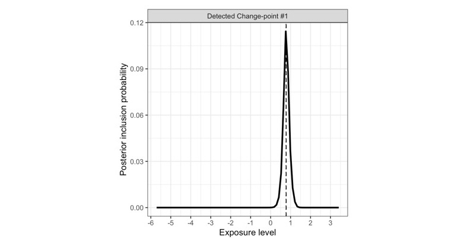
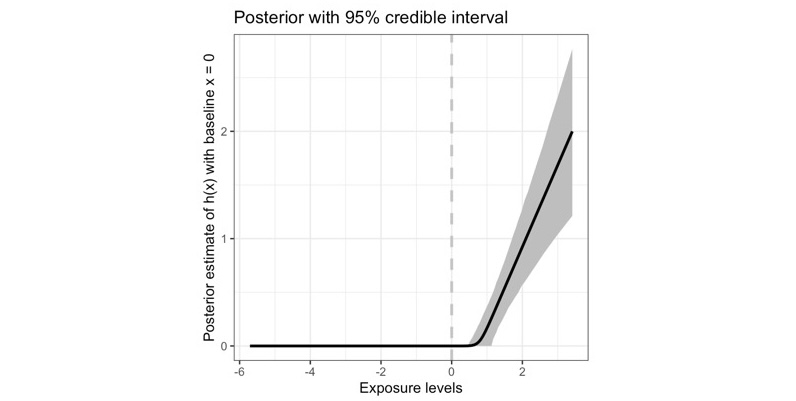

# SSS

The SSS framework for nonlinear IV analysis

This framework contains the three **S** layers (**S**tratification; **S**calar-on-function regression; **S**um-of-single-effect/SuSiE fitting) to conduct powerful nonlinear effect estimation in instrument variable analysis.

The SSS method can work well, even with - [x] *weak IV* - [x] *binary IV* - [x] *complex or unknown confounding pattern*

it is *simple*, *powerful*, and can be *implemented quickly* with quite *low computational burden* 🚀

Paper: *to be added*

## Illustration

install in R

``` r
devtools::install_github("HDTian/SSS")
```

``` r
library(SSS)
```

try the following example, or with your data (`Z` is your IV, `X` is your exposure, `Y` is your outcome)

``` r
N<-50000
set.seed(100)
Z <- rbinom( N , 1 , 0.5 )
U <- rnorm( N , 0 , 1 )
Ex <- rnorm( N , 0 , 1 )
alphaZ<- 0.15
X <-  alphaZ*Z + U + Ex    # weak instrument
# summary( lm(  X  ~ Z )  )$r.squared   #  < 0.01
Ey <- rnorm( N , 0 , 1 )
Y <- 1.0*(X-1)*(X>1)  + U + Ey  # one change-point located at x=1
```

easily fit with one function

``` r
SSS_res <- SSS(Z,X,Y,x_baseline_used = 0)  # use 0 as the basline value for defining the effect function h(x)
```

see the posterior change-point location via `SSS_res$PIP_plot` 

see the estimated effect function $h(x)$ via `SSS_res$hx` 

## 

Interested in stratification and its application in Mendelian randomization with more ML algorithms? see [RFQT](https://github.com/HDTian/RFQT) and [DRMR](https://github.com/HDTian/DRMR)
