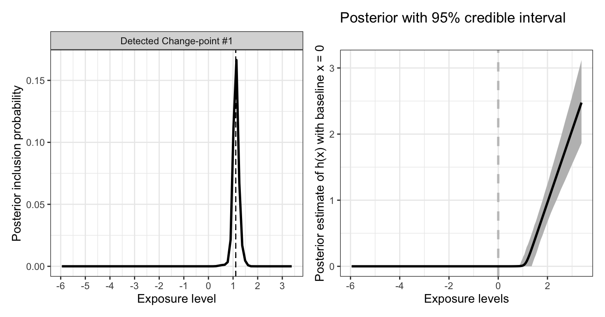

# SSS

The SSS framework for nonlinear IV analysis

The SSS framework is for nonlinear causal effect analysis using instrumental variables to  
* testing whether the effect is nonlinear/heterogeneous or not   
* estimating the causal effect function of any shape in both nonpara and parametric ways  
* investigating the potential effect change-point for both its number and locations with uncertainty measurement 

It makes most use of the three **S** layers (**S**tratification; **S**calar-on-function or **S**calar-on-scalar regression model; **S**um-of-single-effect fitting), so that it can work well with 
(1) weak IV, (2) single binary IV, (3) invalid IV, (4) complex or unknown confounding pattern  

It is simple and can be implemented quickly with quite low computational burden

Preprint: [Stratification-based Instrumental Variable Analysis Framework for Nonlinear Effect Analysis](https://arxiv.org/html/2507.07349v1)

## Algorithm overview

 The graphical overview of the “SSS” framework for complete nonlinear effect analysis. From left to right: (Stratification) Multiple strata are constructed using a stratification approach that ensures the IV assumption holds within each stratum. The stratum-specific IV estimators $\hat{\beta}_k$, and the weight functions, $\hat{W}_k(x)$, are recorded. (Scalar modelling) A scalar-on-function regression is specified and then transformed into a scalar-on-scalar regression via a nonparametric representation of the underlying effect function $h'(x)$. (Sum-of-Single-Effect) A Bayesian approach with spike-and-slab priors is applied to infer change-points from the posterior inclusion probabilities $\pi^\ast$, and to estimate the effect shape function based on all posterior parameters.

**Input:** The one-sample individual-level data of the instrument, the exposure, and the outcome


**Output:** The effect change point inference result, the effect shape estimation result, ...

## Start

install in R

``` r
devtools::install_github("HDTian/SSS")
```

``` r
library(SSS)
```

try the following example, or with your data (`Z` is your IV, `X` is your exposure, `Y` is your outcome)

``` r
N <- 50000
set.seed(100)
Z <- rbinom( N , 1 , 0.5 )
U <- rnorm( N , 0 , 1 )
Ex <- rnorm( N , 0 , 1 )
alphaZ<- 0.15
X <-  alphaZ*Z + U + Ex  
# summary( lm(  X  ~ Z )  )$r.squared   #  < 0.01
Ey <- rnorm( N , 0 , 1 )
Y <- 1.0*(X-1)*(X>1)  + U + Ey  # one change-point located at x=1
```

easily fit with one function

``` r
SSS_res <- SSS(Z,X,Y,x_baseline_used = 0)  # use 0 as the basline value for defining the effect function h(x)
```

see the posterior change-point location via `SSS_res$PIP_plot` (below left), and the estimated effect function $h(x)$ via `SSS_res$hx` (below right) 

try other examples

``` r
Y <- 2*(X+1)*(X>-1) -2*(X-1)*(X>1)   + U + Ey  # two change-points located at x=-1 and x=1
SSS_res <- SSS(Z,X,Y,x_baseline_used = 0)  
```

call `SSS_res$PIP_plot` (or `SSS_res$hx`) for fitting results 

you can also try parametric fitting with specified change-point (e.g. according to posterior mean)

``` r
SS_res <- SS(Z,X,Y,x_baseline_used = 0, pos = SSS_res$posterior_mean )
SS_res$hx
```

## Q&A
Q1: What data should be used for this function?

*A1: You should have the individual-level data, each individuals have the instrument, exposure, and outcome value.*

Q2: I know this function works with a single IV, but what if I have high-dimensional instruments?

*A2: You can aggregate them - partially or entirely - into a single IV score (e.g., polygenetic score), and then use that single IV score as the IV for our function*

Q3: What does the stratification do in the functions `SS` and `SSS`? 

*A3: Currently, `SS` and `SSS` use the doubly-ranked stratification method by default.* 

Q4: I am new to the stratification idea - what is this? 

*A4: Stratification idea means that you can stratify your samples into multiple subgroups such that the instrument is valid in each of your subgroups. If this works in your scenario, you will have a very good motivation to use stratification for nonlinear effect analysis. See the original paper for the detailed discussion and examples on this idea.*

Q5: I am new to the doubly-ranked stratification method - what is this? 

*A5: Doubly-ranked stratification is a method used for stratifying exposure and tries to avoid collider bias. Currently, this is the leading stratification-family method to be considered in many scenarios. It requires the rank-preserving assumptions that the rank index of counterfactual exposure level among the individuals is the same for different instrument levels.*

Q6: How do I decide the number of strata in stratification?

*A6: You may choose the number of strata such that your instrument strength is not too weak in each stratum; or consider multiple numbers of strata as a sensitivity analysis*

Q7: What is the difference between the functions `SS` and `SSS`? 

*A7: `SSS` is the recommended function to implement the complete SSS analysis framework. However, we realize the scenarios which one may prefer to do nonlinear effect analysis using the known polynomial basis function (i.e. traditional parametric way); in such case `SS` can be used.*

Q8: I have specific questions - what should I do?

*A8: Let me know!*


## More to know

Interested in stratification and its application in Mendelian randomization? see [DRMR](https://github.com/HDTian/DRMR) and [RFQT](https://github.com/HDTian/RFQT)
