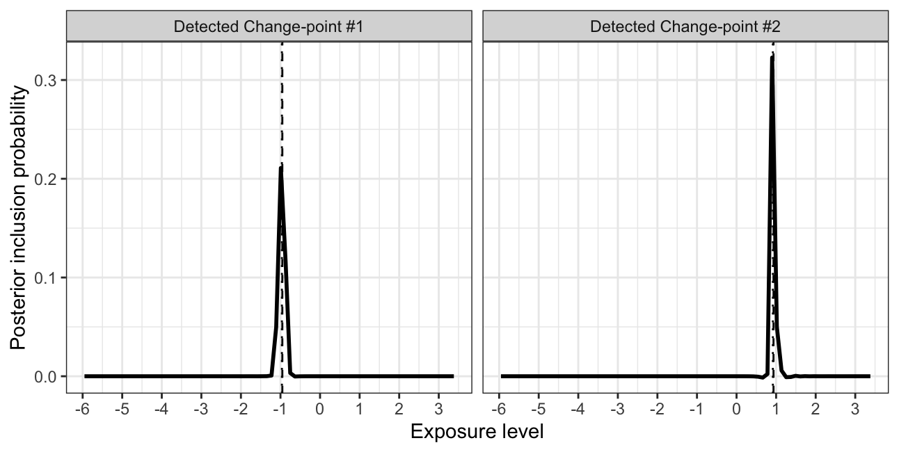

# SSS

The SSS framework for nonlinear IV analysis

The SSS framework is for nonlinear causal effect analysis using instrumental variables to  
✅ testing whether the effect is nonlinear or not   
✅ estimating the causal effect function of any shape in both nonpara and parametric way  
✅ investigating the potential effect change-point for both its number and locations 

It contains the three **S** layers:  
🔧 **S**tratification  
🔧 **S**calar-on-function or **S**calar-on-scalar regression model  
🔧 **S**um-of-single-effect fitting  
so that it can work well even with     
🟢 weak IV   
🟢 single binary IV  
🟢 invalid IV   
🟢 complex or unknown confounding pattern  

it is simple, powerful, and can be implemented quickly with quite low computational burden 🚀

Paper: *to be added*

## Illustration

install in R

``` r
devtools::install_github("HDTian/SSS")
```

``` r
library(SSS)
```

try the following example, or with your data (`Z` is your IV, `X` is your exposure, `Y` is your outcome)

``` r
N <- 50000
set.seed(100)
Z <- rbinom( N , 1 , 0.5 )
U <- rnorm( N , 0 , 1 )
Ex <- rnorm( N , 0 , 1 )
alphaZ<- 0.15
X <-  alphaZ*Z + U + Ex    #very weak instrument
# summary( lm(  X  ~ Z )  )$r.squared   #  < 0.01
Ey <- rnorm( N , 0 , 1 )
Y <- 1.0*(X-1)*(X>1)  + U + Ey  # one change-point located at x=1
```

easily fit with one function

``` r
SSS_res <- SSS(Z,X,Y,x_baseline_used = 0)  # use 0 as the basline value for defining the effect function h(x)
```

see the posterior change-point location via `SSS_res$PIP_plot` (below left), and the estimated effect function $h(x)$ via `SSS_res$hx` (below right) 

try other examples

``` r
Y <- 2*(X+1)*(X>-1) -2*(X-1)*(X>1)   + U + Ey  # two change-points located at x=-1 and x=1
SSS_res <- SSS(Z,X,Y,x_baseline_used = 0)  
```

call `SSS_res$PIP_plot` (or `SSS_res$hx`) for fitting results 

you can also try parametric fitting with specified change-point (e.g. according to posterior mean)

``` r
SS_res <- SS(Z,X,Y,x_baseline_used = 0, pos = SSS_res$posterior_mean )
SS_res$hx
```

## 

Interested in stratification and its application in Mendelian randomization? see [RFQT](https://github.com/HDTian/RFQT) and [DRMR](https://github.com/HDTian/DRMR)
